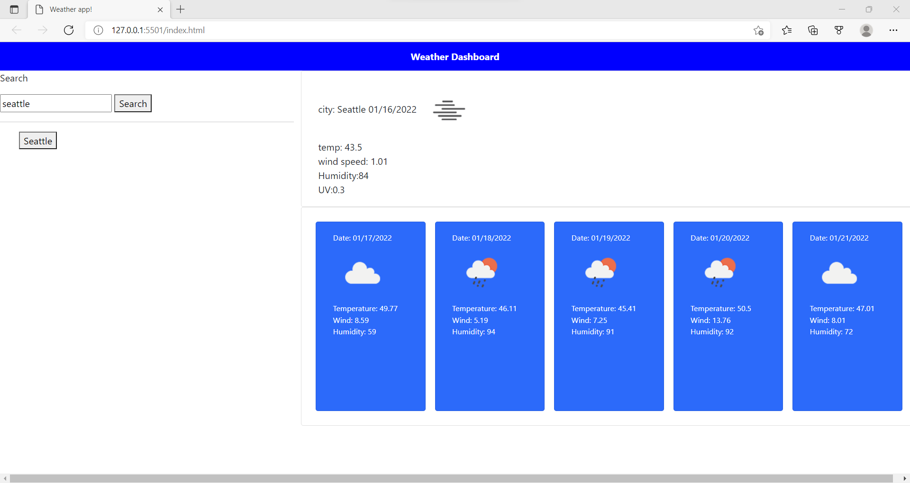
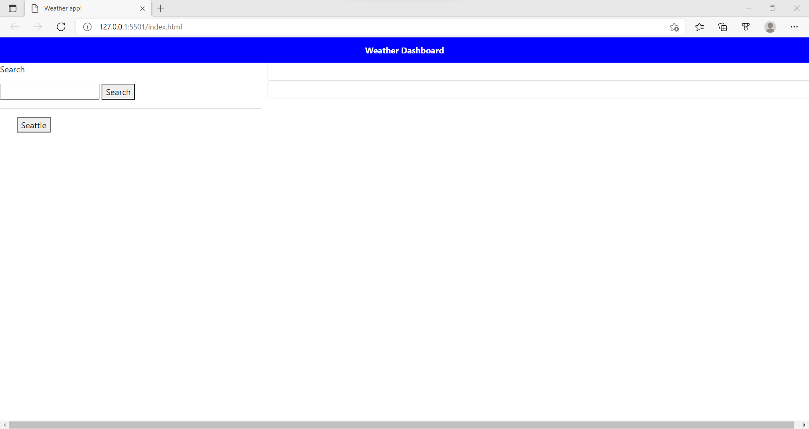

# weather-dashboard-

This is a 5 day weather dashboard!

Just search a city and you will see current weather information, and for the next 5 days. 

This app was built using HTML, CSS, and javascript with a weather API from openweatherapp.com.

What to expect when using the app:
GIVEN a weather dashboard with form inputs
WHEN I search for a city
THEN I am presented with current and future conditions for that city and that city is added to the search history
WHEN I view current weather conditions for that city
THEN I am presented with the city name, the date, an icon representation of weather conditions, the temperature, the humidity, the wind speed, and the UV index
WHEN I view the UV index
THEN I am presented with a color that indicates whether the conditions are favorable, moderate, or severe
WHEN I view future weather conditions for that city
THEN I am presented with a 5-day forecast that displays the date, an icon representation of weather conditions, the temperature, the wind speed, and the humidity
WHEN I click on a city in the search history
THEN I am again presented with current and future conditions for that city

-git hub repo <https://github.com/Bertokeys1/weather-dashboard>
-live page <https://bertokeys1.github.io/weather-dashboard/>

